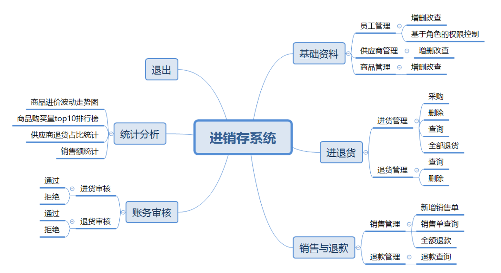

<h3 style="color:red;text-align:center">乐之者java: http://www.roadjava.com/ 制作</h3>

<h1 style="color:orange;text-align:center">进销存系统-前后端分离版</h1>

### 一、项目演示



### 二、使用到的技术

#### 2.1 前端

*  @vue/cli  4.x
*  vue 2.6.x + vue-router + vuex + axios + element ui + echarts

#### 2.2 后端

* springboot 2.3.12.RELEASE + mybatis plus + mysql 5.7.29

### 三、后端配置运行步骤

> psi purchase  sale inventory

#### 3.1 idea导入运行步骤

1. 导入

2. 配置

   * project-->jdk的配置

   * module下面 :  jdk的选择

3. 执行“要用到的sql.sql"

4. 修改config.yml

   * 数据库用户名和密码
   
5. 启动

   ```plain
   访问 http://localhost:8080/
   管理员默认账号/密码：admin/123456
   ```

#### 3.2  eclipse导入运行步骤

1. 导入: file--->open project from file system
2. 配置
   * Resource-->编码utf-8
   * java build path-->jdk的选择
3. 其余与“**3.1、idea导入运行步骤**”中完全一样

### 四、前端配置运行步骤

1. 前端环境

   https://www.bilibili.com/video/BV1CQ4y167oc?spm_id_from=333.999.0.0

   ```shell
   node -v
   npm -v 
   ```

2. 在源码目录执行

   ```shell
   npm install
   ```

3. 启动前端程序

   ```shell
   npm run serve
   ```

   ==注意==： 后端地址的配置位置

4. 启动成功后访问：  http://localhost:9999/#/